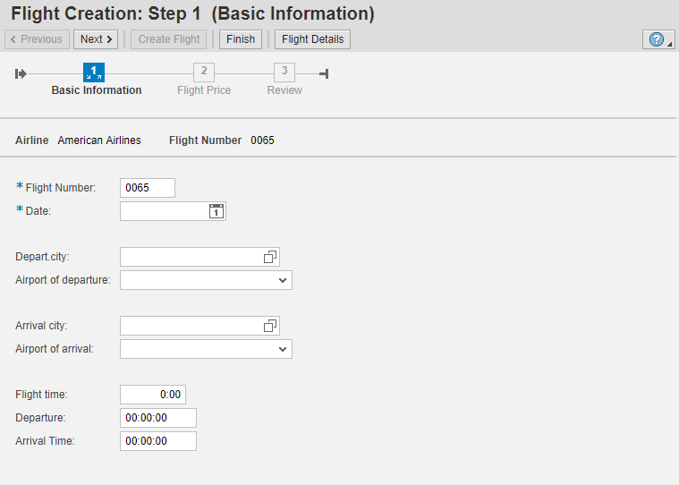
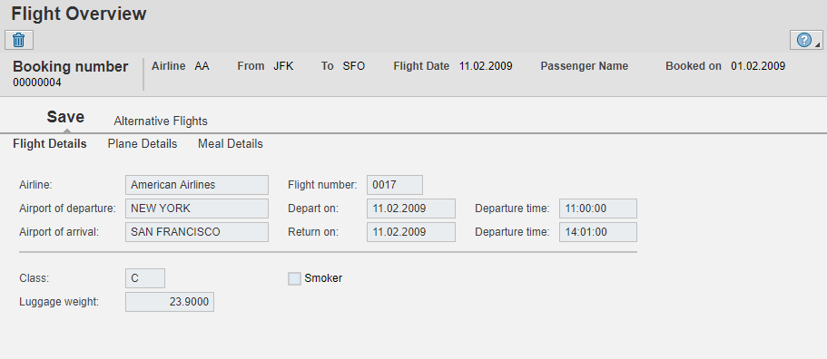

# Floor Plans in SAP

Standard Floorplan components available in SAP

## Guided Activity Floorplan (FPM_GAF_COMPONENT)

Guided Activity Floorplan is used when you need a roadmap UI for creating
a new object or doing a particular process step by step. Validations can be 
applied at each step.

### Sample Application:

- Webdynpro Application: FPM_DEMO_GAF_CREATE_FLIGHT
- Application Configuration: FPM_DEMO_GAF_CREATE_FLIGHT
- Component Configuration: FPM_DEMO_GAF_CREATE_FLIGHT_GAF

## Object Instance Floorplan (FPM_OIF_COMPONENT)

Object Instance Floorplan is used to display all the related data of a object
in different tabs. It has two levels of tabs available.

### Sample Application:

- Webdynpro Application: FPM_DEMO_FLIGHT_OVERVIEW
- Application Configuration: FPM_DEMO_FLIGHT_OVERVIEW
- Component Configuration: FPM_DEMO_FLIGHT_OVERVIEW_OIF

## Overview Page (FPM_OVP_COMPONENT)